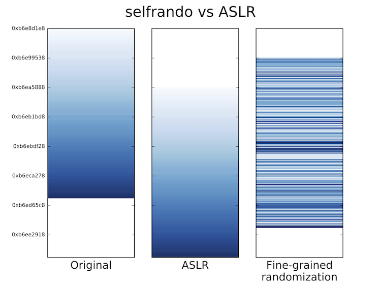

 

# RunSafe Security `selfrando`

Software written in C and C++ is exposed to exploitation of memory corruption. Compilers and operating systems include various exploit mitigation mechanisms that prevent certain offensive techniques. Unfortunately, standard mitigations lag behind the offensive techniques used in exploits against browsers, servers, and other frequently targeted software and do not stop a well-resourced adversary.

`selfrando` can be used to harden your software beyond what is possible with current mitigations. Inspired by biodiversity in nature and existing randomizing defenses, `selfrando` varies the attack surface, i.e., the code layout, by randomizing each function separately. This makes exploit writing harder and increases resilience to information leakage relative to traditional address space layout randomization (ASLR) techniques.

  

## Features

- **Low-overhead** `selfrando` has an imperceptible effect on program initialization and runtime performance. When using the SPEC CPU2006 suite suite, `selfrando` adds less than a 1% overhead to most of the benchmark running times.
- **Load-time randomization**. Binaries built with `selfrando` are all identical on-disk because the code layout is not randomized until it is loaded into main memory. This means that protected programs can be distributed just like traditional programs and can use the same cheksumming and signature tools too.
- **Easy to use** No changes to build tools or processes are required. In most cases, using `selfrando` is as easy as adding a new compiler and linker flags to your existing build scripts.

## Build instructions

- [Linux build instructions](docs/linux-build-instructions.md)
- [Windows build instructions](docs/windows-build-instructions.md)

## License
The Linux-compatible version of `selfrando` is offered under the [Affero General Public License version 1](http://www.affero.org/oagpl.html).

Visit http://runsafesecurity.com if you are interested in a commercial support to protect your software with `selfrando` on Windows, Android, and Linux.

## Acknowledgements
Researchers from University of California, Irvine, Technische Universität Darmstadt (Germany), and the [Tor Project](https://blog.torproject.org/blog/selfrando-q-and-georg-koppen) contributed to the development of selfrando.

This work is based upon work partially supported by the Defense Advanced Research Projects Agency (DARPA) under contracts FA8750-15-C-0124,  FA8750-15-C-0085, and FA8750-10-C-0237 and by the National Science Foundation under award number IIP-1520552.

This work was supported in part by the German Science Foundation (project S2,  CRC 1119 CROSSING), the European Union's Seventh Framework Programme (609611, PRACTICE), and the German Federal Ministry of Education and Research within CRISP.
