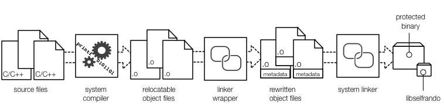

# Selfrando design

Selfrando aims to fulfill the following goals:

1. Randomize code layout at a finer granularity than ASLR.
2. Avoid diversity on disk; randomize in-memory representation.
3. Avoid changes to existing compilers and linkers.
4. Avoid changes to the host operating systems.

Selfrando does not aim to replace other modern mitigations like control-flow integrity and
sandboxing; in fact, these techniques are complementary. Although selfrando supports Linux,
Windows, and Android, this document focuses on Linux.

# Building self-randomizing programs

The following figure shows how self-randomizing programs are built:

To use selfrando, it is necessary to direct the compiler to use a linker wrapper rather than
calling the system linker directly. The Linux linker wrapper, called `traplinker`, intercepts
and processes all linker inputs before passing them on to the system linker (typically `bfd`
or `gold`). The [linux build instructions](linux-build-instructions.md) provides advice on how to pass the right flags to the build system. When `traplinker` intercepts linker invocations, inputs are handled as follows:

- relocatable objects (`.o` files) are rewritten to include translation and protection (TRaP)
information which drives the load-time rewriting process. For instance, TRaP information
identifies the exact in-memory locations of all functions and bytes that need relocation
inside each function. The TRaP information is contained in a new section named `.txtrp`; the
format of this section is documented in the [TRaP specification](TRaP_specification.md).

- static libraries (`.a` files) are updated by rewriting each object file contained in the
archive just like object files passed directly to the linker.

- linker scripts are parsed and any references to relocatable object files are processed.

The linker wrapper does not rewrite relocatable objects, static libraries, or linker scripts
in place. Instead, it creates a copy in the temporary directory of the host system. (These
files are cleaned when `traplinker` exits.) Once all input files have been processed, `traplinker` invokes the system linker substituting the original inputs with rewritten ones. Therefore, the output binary will also contain a `.txtrp` section. Additionally, we add another library dependency – `libselfrando` - which contains the code to shuffle and relocate
functions after they have been loaded by the kernel or the dynamic linker. To ensure that the code layout is randomized before the main application runs, we change the binary entry point point into `libselfrando` and call the original program entry point after randomization.

Since we do not require cooperation from or modifications to the dynamic linker, we must ensure that externally visible functions are reachable from their original address. Therefore,
we place "entry wrappers" consisting of direct jumps at the original function address and
use the randomized function address as the jump destination.

## Compiler requirements

Any compiler can be used with selfrando, but the compiler just outputs each function in a
separate code section (typically this is accomplished by passing `-ffunction-sections`). In addition,
the compiler must generate position independent code (typically using the `-fPIC` option).
Note that selfrando cannot currently be used to compile programs with link time optimization.

## Linker requirements

Traplinker is command line compatible with recent versions of `bfd` and `gold`. 
Using binutils version 2.28 or later is recommended. See [LinkerOptions.table](../src/TrapLinker/posix/LinkerOptions.table) for a list of supported command 
line options. Nothing in the design of selfrando precludes us from adding 
support for additional options and linkers in the future.

# Load-time randomization

Since randomization happens before the program itself starts executing, no program functions have been called and no code pointers have been created in the data regions. Had that not been the case, we'd have to scan stacks, heaps, and global data areas and update any code pointers to their randomized locations. Instead, we only need to update the code pointers inside the binary itself. These reside in the code and read-only data sections - e.g., inside C++ vtables and exception handling sections - and are identified in the TRaP information.  

The first step at load time is to read and parse the TRaP information in the `.txtrp` section. Next, we count and build a sorted list of all functions to randomize. Sorting functions makes it faster to look up functions by address; function lookups are frequent later on. We then shuffle the function list and move the actual functions around in memory. Finally, we need to ensure that all absolute and relative references inside the shuffled code are updated to point to the new locations. We use OS-provided relocation information to adjust all absolute pointers and use additional relocations encoded in the `.txtrp` section to adjust relative references that do not need relocation to work with ASLR. Finally we adjust the entry wrappers and transfer execution to the original entry point.

# Known issues

- Selfrando adds to the program startup time; some of this can be optimized away.
- Selfrando is not ideal for shared libraries since it breaks page sharing. Our [pagerando](http://www.ics.uci.edu/~perl/sd16_pagerando.pdf) technique was developed specifically to address this issue. 
- 64-bit operation has been tested more extensively than 32-bit operation.
- Selfrando may trigger bugs or asserts in the system linker. Switching from `bfd` to `gold` or vice versa may avoid the issue. If, not, try upgrading to a newer version of binutils.  
- Selfrando may interfere with debugging, error reporting, and stack unwinding functionality.
- The [issue tracker](https://github.com/immunant/selfrando/issues) lists all known issues.
